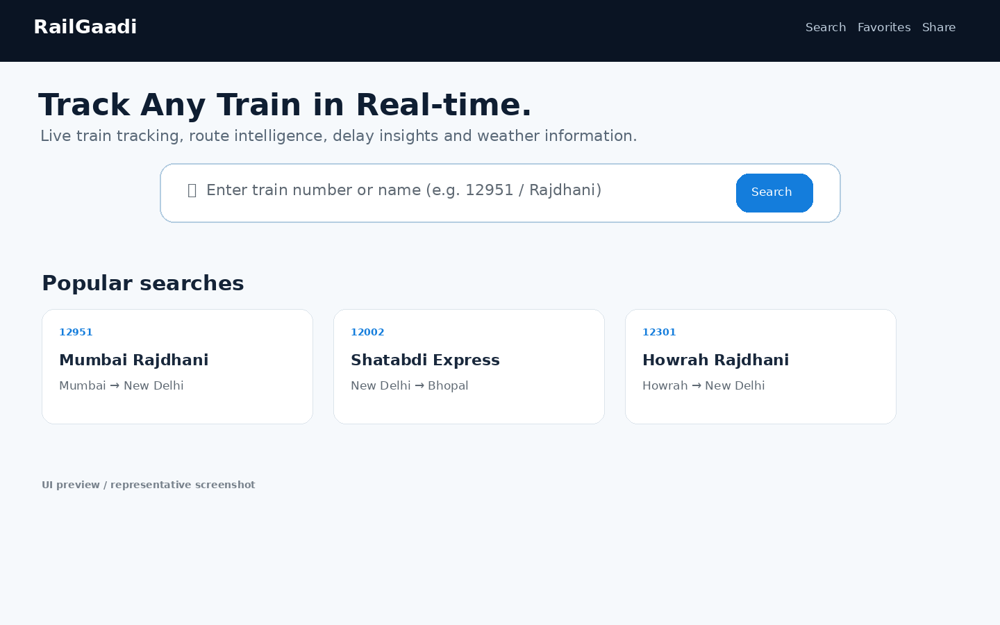
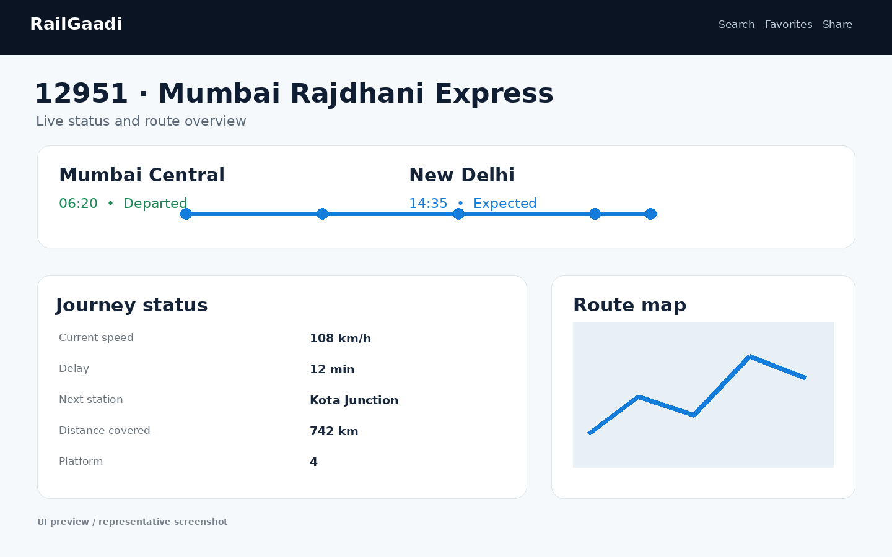
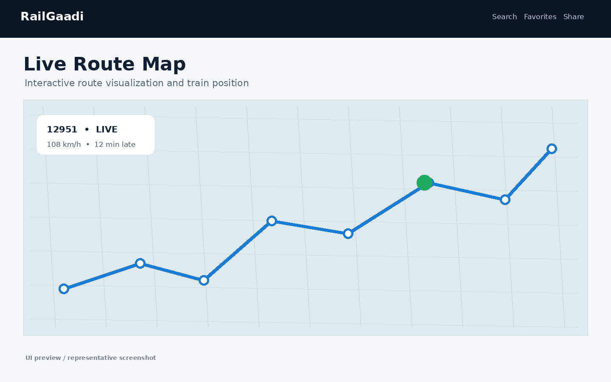
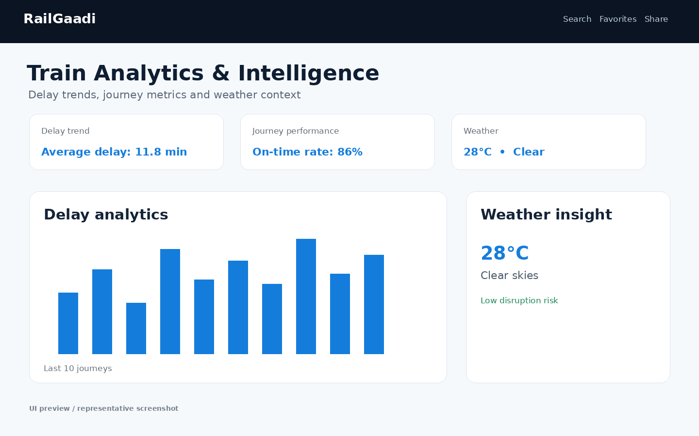

# 🚆 RailGaadi — Indian Railway Intelligence Platform

<p align="center">
  <strong>Real-time train tracking • Route intelligence • Delay analytics • Weather context</strong>
</p>

<p align="center">
  <a href="https://github.com/udaysharmadev/RailGaadi">Original Repository</a>
</p>

---

## 📌 Overview

**RailGaadi** is a modern Indian railway intelligence web application designed to help users search trains and explore train-related information through a clean, interactive interface.

The project is built with **Next.js 14, React 18, TypeScript and Tailwind CSS**, with supporting libraries for animations, maps, state management and data utilities.

The current repository structure includes the Next.js App Router, API routes for search/train/analytics/terrain/weather, train-detail routes, favorites and share routes, and reusable components/features.

> **Note:** The screenshots below are representative UI preview mockups created for documentation. Replace them with real screenshots from your running application before presenting the project as production evidence.

---

## ✨ Key Features

- 🔎 **Train search** by train number or train name
- ⚡ **Instant client-side search** using the bundled train database
- 🚆 **Train detail pages** with dynamic train-number routes
- 📍 **Route and location visualization**
- 🗺️ **Interactive map support** using MapLibre GL
- 📊 **Train analytics and delay insights**
- 🌦️ **Weather intelligence**
- ⭐ **Favorite trains**
- 🔗 **Shareable train pages**
- ⌨️ **Keyboard-friendly search** with `⌘ K` / `Ctrl + K`
- 🎞️ **Smooth UI animations** using Framer Motion
- 🌓 **Responsive modern interface**

The homepage implementation includes debounced search, recent searches, dynamic train routing and a search dropdown. The repository's API structure includes search, train, analytics, terrain and weather endpoints.

---

## 🖥️ Screenshots

### 🏠 Home & Train Search



### 🚆 Train Details



### 🗺️ Live Route Map



### 📊 Analytics & Weather



---

## 🧰 Tech Stack

| Technology | Purpose |
|---|---|
| **Next.js 14** | Full-stack React framework and App Router |
| **React 18** | UI development |
| **TypeScript** | Type-safe development |
| **Tailwind CSS** | Responsive styling |
| **Framer Motion** | UI animations |
| **Lucide React** | Interface icons |
| **MapLibre GL** | Interactive maps |
| **TanStack React Query** | Data/query management |
| **Zustand** | Client-side state management |
| **Turf.js** | Geospatial utilities |

---

## 🏗️ Project Structure

```text
RailGaadi/
├── app/
│   ├── api/
│   │   ├── analytics/
│   │   ├── search/
│   │   ├── terrain/
│   │   ├── train/
│   │   └── weather/
│   ├── favorites/
│   ├── share/
│   ├── train/
│   │   └── [id]/
│   ├── layout.tsx
│   └── page.tsx
│
├── components/
├── config/
├── features/
├── hooks/
├── lib/
├── providers/
├── public/
├── store/
├── styles/
├── types/
├── utils/
│
├── .env.example
├── next.config.mjs
├── package.json
├── postcss.config.mjs
├── tailwind.config.ts
└── tsconfig.json
```

---

## 🔍 How Train Search Works

The application uses a local train database for the search experience.

The search hook maps matching train records into a normalized result containing:

- Train number
- Train name
- Origin station
- Destination station

This enables fast client-side results without requiring a network request for every search.

Example:

```text
User enters:
12951

        ↓

Local train database search

        ↓

Matching train

        ↓

Train number + name + origin + destination

        ↓

Dynamic train details page
```

---

## 🚀 Getting Started

### 1. Clone the repository

```bash
git clone https://github.com/faizanalam-1457/RailGaadi-Train-Booking-System.git
cd RailGaadi-Train-Booking-System
```

### 2. Install dependencies

```bash
npm install
```

### 3. Configure environment variables

Create a `.env.local` file if the application requires environment-specific configuration.

Use the provided example:

```bash
cp .env.example .env.local
```

Then configure the required values.

### 4. Run the development server

```bash
npm run dev
```

Open:

```text
http://localhost:3000
```

### 5. Create a production build

```bash
npm run build
```

### 6. Start the production server

```bash
npm start
```

---

## 📡 Application Routes

The repository currently contains application/API routes for:

```text
/
├── /train/[id]
├── /favorites
├── /share/[id]
│
└── /api
    ├── /analytics/[id]
    ├── /search
    ├── /terrain
    ├── /train/[id]
    └── /weather
```

---

## 🎯 Project Highlights for Recruiters

### Frontend Engineering
- Next.js App Router
- React component architecture
- TypeScript
- Responsive Tailwind UI
- Framer Motion animations

### Data & State
- Client-side train search
- Zustand state management
- TanStack React Query
- Structured train data types

### Geospatial Features
- MapLibre GL
- Route visualization
- Turf.js geospatial utilities
- Terrain/location-related API routes

### Product Thinking
- Recent searches
- Favorites
- Shareable train pages
- Keyboard shortcuts
- Loading and error states

---

## 🧪 Development Commands

```bash
# Development
npm run dev

# Production build
npm run build

# Production server
npm start

# Lint
npm run lint
```

---

## 📦 Deployment

The project is structured as a Next.js application and can be deployed on platforms that support Next.js.

Recommended deployment workflow:

```text
GitHub
   ↓
Connect repository
   ↓
Install dependencies
   ↓
npm run build
   ↓
Deploy
```

For environment-dependent features, configure the required variables in the deployment platform.

---

## 🔐 Environment Variables

Do not commit private API keys or secrets.

Use:

```text
.env.local
```

and keep secrets outside Git history.

The repository provides:

```text
.env.example
```

as a configuration reference.

---

## 📚 Learning Outcomes

This project demonstrates practical experience with:

- Modern React development
- Next.js App Router
- TypeScript
- API route organization
- Client-side search
- State management
- Data fetching patterns
- Geospatial visualization
- Interactive maps
- Responsive UI development
- Production build and deployment workflows

---

## 👨‍💻 Author

**Faizan Alam**

Computer Science / AI & ML / Full-Stack Developer

GitHub:  
https://github.com/faizanalam-1457

---


## 📄 License

Check the original repository for the applicable licensing information before redistributing or presenting modified versions.

---

<p align="center">
  🚆 <strong>RailGaadi</strong> — Explore India's railway network with a modern intelligence-first experience.
</p>
